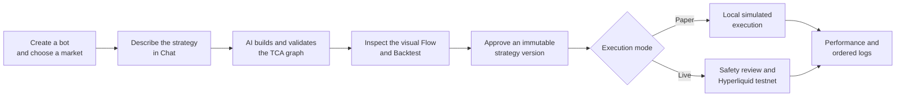

<p align="center">
  
</p>

<h1 align="center">Catbots</h1>

<p align="center">
  <strong>Describe a trading idea. See the logic. Backtest it. Run it.</strong>
</p>

<p align="center">
  A local-first AI workbench for building auditable perpetual DEX trading bots without writing code.
</p>

> [!WARNING]
> Catbots is experimental trading software, not financial advice. The current Live integration is restricted to Hyperliquid testnet. Backtest and Paper results do not predict future performance.

## Why Catbots exists

A trader can express an idea in a sentence—“when RSI is oversold and funding is negative, open a small long position”—but turning that idea into a dependable bot usually means writing code, joining market data, handling exchange APIs, testing edge cases, and building safety controls.

AI can help write that code, but generated trading code creates a new problem: it is difficult for a non-programmer to inspect, compare, or trust. A strategy may look plausible in Chat while behaving very differently when money is involved.

Catbots bridges that gap. You talk to an AI strategy designer, and Catbots turns the conversation into a constrained, versioned program made from three concepts:

```text
Trigger  →  Condition  →  Action
```

The JSON strategy remains the canonical source of truth, but the trader does not need to read it. Catbots renders the program as a React Flow graph, validates its structure, runs deterministic Backtests, and records the complete execution trail before a strategy can reach Paper or Live mode.

## What Catbots helps you do

- **Turn plain-language requirements into bots.** The AI Agent discovers the supported nodes and data products, builds the strategy, validates it, and can call Backtest as a tool.
- **Understand what the bot will do.** Every strategy is visualized as Trigger → Condition → Action nodes instead of being hidden inside generated code.
- **Express advanced logic simply.** Conditions can be nested with `ALL`, `ANY`, `NOT`, and `AT LEAST`, with separate flows for scheduled and external events.
- **Test before execution.** Deterministic Backtests expose assumptions, metrics, trades, warnings, and trace-linked outcomes.
- **Control execution risk.** Approved revisions run through hard market, side, order-size, position, leverage, loss, drawdown, and rate limits.
- **Audit every flow.** Trigger receipt, context resolution, condition evaluation, risk decisions, order state, and terminal outcomes are written as ordered events.
- **Keep control local.** Profiles, strategies, SQLite data, LLM credentials, and exchange credentials stay on the user's computer. Catbots has no cloud account or telemetry service.

## How it works



1. **Create** — Give the bot a name and select its perpetual market.
2. **Design with Chat** — Explain entries, exits, position sizing, indicators, and event-driven rules in normal language.
3. **Inspect and test** — The Agent produces a valid graph and invokes the Backtest tool. You can inspect nodes, metrics, trades, warnings, and traces without opening JSON.
4. **Approve** — Execution is bound to an exact immutable strategy version; a later edit becomes a new draft.
5. **Run** — Start in Paper mode or pass the dedicated Live safety review for Hyperliquid testnet. Pause or stop from the persistent controls.

### Example strategy

Catbots can represent a strategy such as:

```text
Every 15 minutes
  IF position is flat
  AND AT LEAST 2 OF
    - RSI 14 is below 35
    - perpetual funding is below 0
    - BTC ETF daily net flow is positive
  THEN open a 2× BTC long with 10% of equity and a 5% stop loss

When BTC ETF flow is updated
  IF daily net flow is negative
  THEN close 100% of the position
```

This uses two independent triggers, combined conditions, indicator and external-data references, and separate entry and exit actions. The real-model acceptance test asks a locally running Qwen model to create this graph and complete its Backtest.

## Product principles

### Visual, but deterministic

The visual graph and JSON document describe the same versioned strategy. Nodes come from a registry with explicit configuration and port contracts, so invalid connections fail validation instead of becoming ambiguous runtime behavior.

### AI proposes; the runtime decides

The Agent is limited to named tools such as node discovery, validation, explanation, version comparison, and Backtest. It cannot execute arbitrary code, access wallet credentials, approve its own revision, or silently enable trading.

### Data enters through context

Conditions reference named, typed values such as price, funding, RSI, account position, or ETF flow. The runtime resolves those values into a point-in-time evaluation context with freshness and quality metadata. This boundary allows future data providers and marketplace products to be added without changing the strategy language.

### Fail closed

Missing or stale data produces an unknown/failed path rather than an optimistic trade. Live execution requires successful preflight checks, durable audit writes, deterministic client-order IDs, and reconciliation. An uncertain venue response is never blindly submitted twice.

## Quick start

The current release is macOS-only. Windows and Linux packaging is not supported yet.

### Requirements

- macOS
- Node.js 22.x
- pnpm 10.17.1
- An OpenAI-compatible or Anthropic-compatible LLM endpoint

```sh
git clone https://github.com/0xlabsTeam/catbots.git
cd catbots
pnpm install
pnpm dev
```

On first launch:

1. Create a **Local Profile**.
2. Enter the LLM provider URL, API key, and model in **Settings**.
3. Select **Test connection**, then save.
4. Create a bot and describe its rules in Chat.

Settings is the only in-app writer of `local.env.yaml`, stored inside the Catbots Electron data directory. Use [local.env.example.yaml](local.env.example.yaml) only as a placeholder reference and never commit the real file.

### Browser preview

To explore the interface without launching Electron:

```sh
pnpm dev:web
```

The browser preview is intentionally simulated. It uses in-memory data, resets on reload, does not retain API keys, and performs no YAML, SQLite, runtime, or exchange operations. Use the Electron application for native integration testing.

## Using a local model with LM Studio

Catbots connects to LM Studio through its OpenAI-compatible API. A tested configuration is:

| Setting | Value |
| --- | --- |
| Base URL | `http://127.0.0.1:1234/v1` |
| API key | `lm-studio`, or the token configured in LM Studio |
| Model | `qwen/qwen3.8-27b` |
| Reasoning effort | `Off` for Qwen tool workflows |

With LM Studio running and the model loaded, execute the real-model acceptance test:

```sh
pnpm test:lmstudio
```

Override the defaults with `CATBOTS_LMSTUDIO_URL` and `CATBOTS_LMSTUDIO_MODEL`. The test uses an isolated in-memory database and never changes the desktop profile.

## Paper and Hyperliquid testnet

### Paper mode

Backtest and approve a strategy, then select **Run Paper**. The current defaults allow a maximum $1,000 order, $2,500 position, 3× leverage, $300 daily loss, 12% drawdown, and four orders per minute for the selected market. Use **Performance** to inspect state and **Logs** to inspect ordered audit events. **Pause** retains Paper state; **Stop** persistently terminates the deployment.

### Hyperliquid testnet Live mode

1. Authorize a dedicated Agent/API Wallet from the intended Hyperliquid testnet account. Never give Catbots the master-wallet private key.
2. In **Settings**, enable Hyperliquid testnet and enter the master account's public address plus the dedicated Agent/API Wallet private key.
3. Backtest and approve the exact revision, then select **Review Live**.
4. Resolve every failed connection, account, data, risk, audit, runtime, and reconciliation check.
5. Type the bot name exactly and select **Start Live**. Use the persistent **Stop Live** control for an emergency stop.

Mainnet is not selectable. Testnet funds and credentials should still be treated as sensitive.

## Architecture

| Area | Responsibility |
| --- | --- |
| Electron Main | Local configuration, SQLite persistence, secure IPC, runtime supervision, deployments, and exchange access |
| React renderer | Kumo-based desktop UI, Chat workbench, React Flow visualization, Backtest results, Live Review, performance, and logs |
| `@catbots/contracts` | Strict renderer-safe DTOs, IPC inputs, deployment schemas, and audit views |
| `@catbots/strategy-runtime` | TCA schema, Node Registry, graph validation, three-valued conditions, deterministic evaluation, Backtest, and trace generation |
| `@catbots/execution-core` | Venue-neutral adapter contract, Risk Engine, idempotency, and normalized execution types |
| Hyperliquid adapter | Testnet normalization, Agent Wallet signing, preflight, order submission, and reconciliation |

The Hyperliquid integration sits behind a venue-neutral `PerpDexAdapter`, so another perpetual DEX can be added without changing canonical strategy semantics.

## Security model

- The renderer is sandboxed and receives only a small validated preload API.
- Secrets stay in Electron Main, are masked when read back, and are excluded from Agent prompts, traces, logs, and diagnostics.
- Hyperliquid configuration accepts an Agent/API Wallet only; master-wallet private keys are rejected.
- Live writes its proposed action, approved risk decision, and outbox item before any adapter side effect.
- Duplicate triggers and retries reuse deterministic idempotency and client-order IDs.
- Failed audit, risk, data, preflight, or reconciliation checks prevent or suspend Live execution.

See [SECURITY.md](SECURITY.md) to report a vulnerability privately.

## Development and verification

```sh
pnpm typecheck
pnpm test
pnpm test:e2e
pnpm make
```

The E2E suite packages the Electron application and uses an isolated operating-system temporary directory. The release build gate requires Node.js 22 on macOS, inspects the application bundle and `app.asar`, and rejects local credentials or development artifacts from the generated ZIP.

The current macOS artifact is written beneath `apps/desktop/out/make`.

See [CONTRIBUTING.md](CONTRIBUTING.md) for development conventions, the [delivery roadmap](docs/superpowers/plans/2026-09-03-catbots-delivery-roadmap.md) for milestone scope, and the [TCA product specification](docs/superpowers/specs/2026-09-03-tca-perp-bot-design.md) for the complete domain design.

## Project status

Catbots currently includes the local desktop foundation, deterministic strategy and Backtest core, AI Bot Workbench, Paper execution, and guarded Hyperliquid testnet execution. The next milestone expands performance views, the data catalog and ETF Flow provider, recovery tooling, accessibility coverage, and signed release packaging.

The codebase is being prepared for open-source distribution, but no license has been selected yet. Until a license is added, copyright remains with the project owner and reuse terms are not granted automatically.
